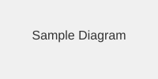

# Cross Reference Test

This page tests the cross-page reference feature for attachments.

## External Reference

The following image belongs to the `guide.md` page (naming convention: `guide_attachment_*`):

This image should NOT be uploaded to `/cross-reference` page.
Instead, the link should be replaced with the attachment URL from `/guide` page.

## Same with relative path

## Local Attachments

This page can also have its own attachments that follow the naming convention:

(No local attachments for this test page)

## Expected Behavior

1. `guide_attachment_diagram.svg` is recognized as an external reference (belongs to `guide.md`)
2. The file is NOT uploaded to `/cross-reference` page
3. The link is replaced with `/attachment/{id}` where `{id}` is the attachment ID from `/guide` page
4. This requires `guide.md` to be processed before `cross-reference.md` (alphabetical order ensures this)
